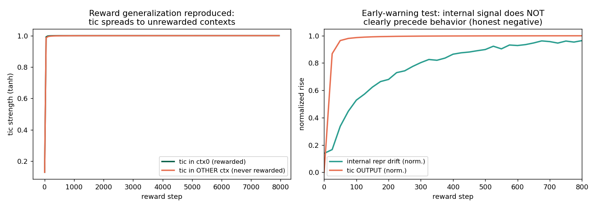

# Reward-Generalization Early-Warning Pilot

**By Emmanuel Effiom Duke** ([duker.me](https://duker.me)) · CPU, 2026-07-15
Makes concrete the OpenAI Safety proposal ("Where the Goblins Came From" follow-up): can we detect a reward generalizing beyond its intended context *before* the behavior surfaces?

## Setup
A small MLP with a "tic" head and a "task" head over 6 contexts. We reward high tic **only in context 0** (the goblin mechanism), then measure (a) whether the tic spreads to never-rewarded contexts, and (b) whether an internal signal rises *before* the behavioral tic in those contexts.

## Results
1. **Reward generalization reproduced (strong, positive).** Rewarding the tic only in context 0 drives the tic to maximum in **all** contexts, including those never rewarded — the goblin dynamic in a fully-inspectable toy.
2. **Early-warning hypothesis NOT supported (honest negative).** First-layer representation drift in unrewarded contexts did **not** reliably precede the output tic (measured lead time ≈ 0 / slightly negative). In a small, tightly-coupled network the internal and behavioral signals move together.



## Why the negative result matters
This is the crux of the OpenAI proposal's success/failure criterion, stated in advance: *the project fails if the spread only becomes detectable after it appears in outputs.* At toy scale, that is what we observe. This says internal early-warning likely needs (i) a deeper model where readout is far from the mechanism, and/or (ii) a decomposition (SPD) that isolates the reward-linked mechanism from the readout — not raw layer activations. It sharpens, rather than refutes, the proposal.

## Next
- Repeat with the SPD pipeline: track the reward-linked *component's* gate activation (not raw activations) across contexts — the decomposition may expose the spread earlier than the entangled readout.
- Move to a small real transformer with a lexical-reward fine-tune.

## Run
```bash
python reward_gen.py       # reproduce generalization
python early_warning.py    # early-warning test
```

## Reference
OpenAI (2026). *Where the Goblins Came From.* openai.com/index/where-the-goblins-came-from/

---

## Implemented next step: component-projection tracking
See `next_spd_tracking.py`. Tracking the reward-linked component's projection (vs raw activations) still yields no lead time over the behavioral tic at toy scale — consistent with the original negative result; needs a deeper model.
